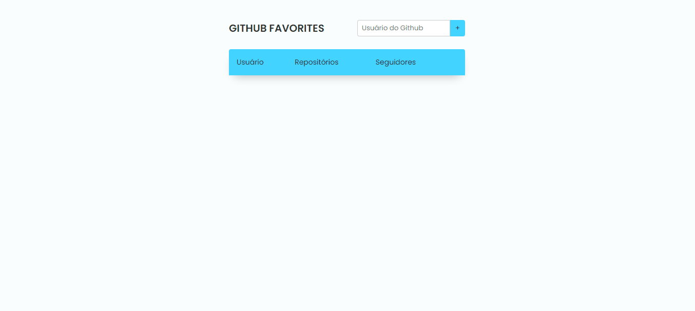

## 💻 Projeto

Desafio que consistia em  criar uma página favoritar usuários do github, utilizando a API pública do GitHub
## 🚀 Tecnologias

<ul>
  <li>HTML</li>
  <li>CSS</li>
  <li>Javascript</li>
  <li>API Github</li>
</ul>

## 🔖 Layout do Projeto

O layout pode ser visto através do Figma

[Layout Web](https://www.figma.com/file/c6g8Ng8b3S5Wca7ItcBTt9/Desafios-Explorer-GitFav-Copy-Copy?fuid=1044716808414252537)
